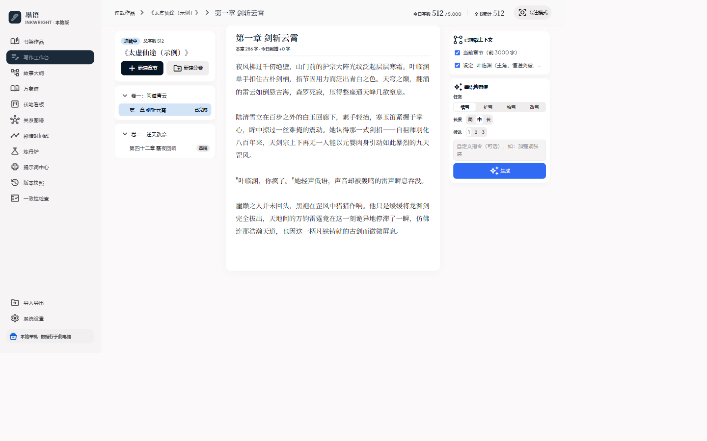
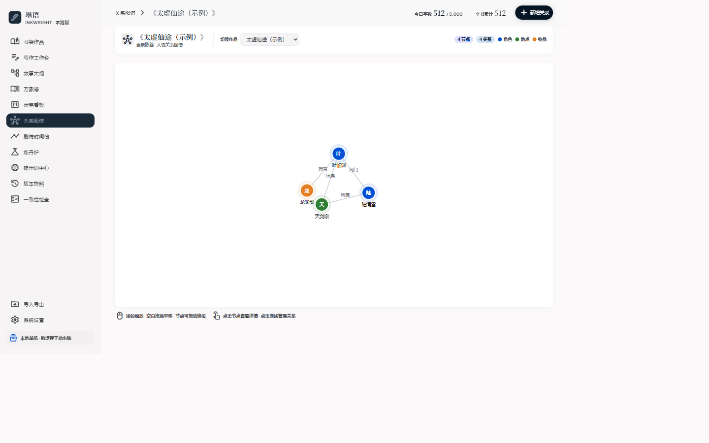
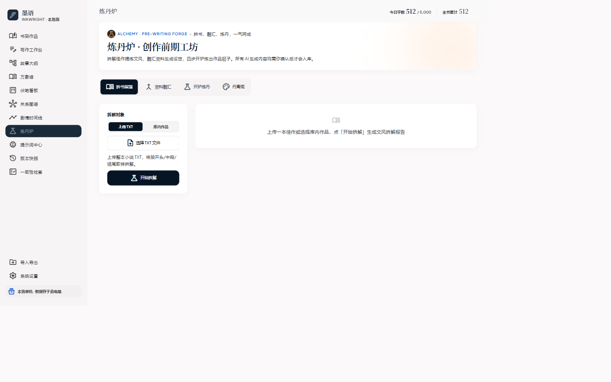

<div align="center">

# 墨语 MoYu · 本地与云端 AI 小说写作工作台


**一支笔、一炉丹、一盏灯——部署在本地或私有 VPS、数据不出机的一站式 AI 长篇创作工作台。**

[](LICENSE)
[](https://github.com/GitHubAres/MoYu/releases)
[](https://www.python.org)
[]()
[]()
[]()

[下载安装](#-安装与运行) · [功能一览](#-功能一览) · [更新日志](#-更新日志) · [部署文档](docs/deployment.md)

</div>

---

「墨语MoYu」面向网文作者与长篇创作者：涵盖**灵感孵化、大纲规划、正文写作、设定管理到作品导出**的完整闭环。全部数据存储在私有 SQLite，AI 是严谨可控的创作助手——**所有 AI 内容先预览、由你确认后才入库，绝不静默写入正文。**

## 📸 界面速览

| 书架仪表盘 | 写作工作台 |
|:-:|:-:|
|  |  |

| 关系图谱 | 炼丹炉 |
|:-:|:-:|
|  |  |

## ✨ 功能一览

| 模块 | 能力与特性 |
|---|---|
| 🖥️ 原生桌面与全端响应式 | 基于 Windows WebView2 原生窗口（1366x820），支持 `--browser` 外部浏览器与手机/平板自适应，全端无横向滚动条，移动端抽屉导航与大触控区适配（≥44×44px，clamp 流式字号） |
| 🚢 生产级 VPS 与容器部署 | 官方提供轻量 Dockerfile（基于 python:3.11-slim，非 root 运行）、docker-compose 卷持久化、Nginx 反代（支持 AI 流式输出不卡顿）及 systemd 常驻守护支持 |
| 📚 书架仪表盘 | 作品管理、字数/今日目标统计卡片、搜索过滤、最近写作直达侧栏 |
| ✍️ 写作工作台 | 卷章拓扑树、沉浸大字号纯文本编辑器、自动保存、专注模式、查找替换、选区悬浮工具栏、章节拖拽排序 |
| 🤖 AI 修撰使 | 多轮对话式伴写窗口，支持按章节独立维护会话与重置，SSE 流式打字机生成，选区与设定库深度感知，采纳前自动快照留存且可一键撤销，内置经典多候选对比模式开关 |
| 🧠 AI 模型自动识别 | 设置页一键拉取上游服务商真实模型清单（DeepSeek / Kimi / 智谱 / 通义 / OpenAI 兼容），下拉浏览、搜索、点选回填，24 小时本地缓存降噪，上游不支持 `/models` 时优雅降级为预设列表 |
| 📑 故事大纲 | 树形卷章大纲、节点详情摘要、卷章自动关联、AI 剧构推演与草稿生成 |
| 🗃️ 设定人物库 | 角色/地点/势力/物品等类型设定卡片 CRUD，正文智能识别关联，可一键挂载到 AI 上下文 |
| 🕸️ 关系图谱 | 人物与实体关系网络力导向图可视化，缩放/平移/拖拽，直观编辑势力关系连线 |
| ⏳ 剧情时间线 | 纵向大事记时间轴编排，事件概要、涉及章节与登场人物关联 |
| 🏛️ 伏笔看板 | 未解/推进中/已收线三泳道流转，埋笔描述、回收设想与章节定位 |
| ⚗️ 炼丹炉 | 故事骨架与立意推演 → 世界观法则生成 → 核心角色塑造 → 一键开炉建书生成长纲与设定集 |
| 🎨 丹青阁 | AI 生成作品封面与角色立绘，本地画廊管理，一键设为作品封面 |
| 🕰️ 版本快照 | 定时与 AI 采纳自动快照、手动快照、行级差异对比、一键无损回滚（恢复前自动留底） |
| 🛡️ 一致性检查 | AI 审计章节正文与设定集实体的冲突与前后矛盾，附原文引用定位与修改指引 |
| 💬 Skill 市场 | 系统预置精调模板（续写/扩写/缩写/润色）+ 自定义提示词模板增删改查 |
| 📋 任务中心 | 异步后台 AI 任务列表、进度追踪、错误日志回溯与重试 |
| 🔄 软件自动更新 | 设置页内置版本检查与发布日志展示，支持稳定/尝鲜通道与国内镜像加速；桌面端引导下载与版本跳过；Linux/VPS 一键自动备份与代码平滑升级，Docker 支持 Watchtower 自动更新 |
| 📦 导入导出 | TXT/DOCX 智能正则拆章导入，全书/按卷多格式导出排版文稿，整库结构化备份 |
| 🔍 全局搜索 | Ctrl+K 极速唤起，跨作品/章节/设定/大纲全库秒级检索定位 |

## 🆕 最近更新（v1.7.x）

| 版本 | 日期 | 亮点 |
|---|---|---|
| **v1.9.7** | 2026-10-08 | AI 修撰使功能字数选择新增“不上限”选项：复用现有 /api/chat 与技能提示词生成链路，扩充 unlimited/不上限 提示词与思考步骤解析；161 项测试全绿 |\n| **v1.9.6** | 2026-10-07 | 彻底清除灵感便签功能：全面下线 /api/notes 路由、书架侧栏便签、全局悬浮记录按钮(FAB)、Ctrl+J快捷键与设定写入脏数据；书架恢复极简全宽作品矩阵；160 项测试全绿 |
| **v1.9.5** | 2026-10-07 | 写作工作流多前序步骤动态上下文装配重构：彻底解决输入来源与引用步骤冗余分裂问题、统一支持多前序步骤产出自由组合与模板变量替换、前端提供直观装配面板、160 项测试全绿 |
| **v1.9.4** | 2026-10-07 | 剧情时间线/工作流同步/万象谱多端互通修复：彻底修复时间线与工作流未定义变量死区、工作流全量解析角色四维档案并入库、章节登场引用自动双向绑定与选择器、158 项测试全绿 |
| **v1.9.3** | 2026-10-07 | 工作流全流程资产一键自动反哺看板：全流程资产合并提取与库内差异比对（全新收录 vs 增量更新）、步骤全部审批通过后自动呼出全流程反哺看板、章节双向自动绑定、157 项测试全绿 |
| **v1.9.2** | 2026-10-07 | 创作技能交付规范与设定探测入库：内置五大 Skill 交付模版标准化、写作台未入库设定智能探测与批量入库确认闭环、写作台与三位一体（大纲/时间线/伏笔）深度联动、156 项测试全绿 |
| **v1.9.1** | 2026-10-07 | 核心架构契约与工作流三位一体联动：后端沉淀 PlotService 与 ContextService 领域服务层、统一数据契约、前端统一 Store 与事件总线、写作工作流深度绑定大纲节点与剧情脉络实时双向流转、154 项测试全绿 |
| **v1.9.0** | 2026-10-07 | 功能去重与体验一体化重构：工作台 AI 伴写收敛（多候选卡片并排与 Tab 对比、5 大任务与字数档位快捷选择）、剧情脉络三位一体（大纲/时间线/伏笔双向穿透与徽章联动）、实体关系网络直观维护与图谱实时反哺、153 项测试全绿 |
| **v1.8.4** | 2026-10-06 | 写作工作流全功能规范打通（立项前置配置弹窗、万相谱/图谱/大纲/伏笔全量同步、多方案独立采纳）、修复作品级联删除与便签隔离 |
| **v1.8.3** | 2026-10-06 | 写作工作流全流程资产规范同步打通（世界观/万相谱/图谱/大纲/正文），支持方案提取与前置确认弹窗 |
| **v1.8.2** | 2026-10-05 | 写作工作流支持智能识别 AI 备选方案并一键采纳；优化 AI 测试连接 max_tokens 与错误诊断提示；增强 sub2api 网关兼容性 |
| **v1.8.1** | 2026-10-05 | 修复「写作工作流」长文本生成被 120 秒超时提前中断缺陷；支持在系统设置中自定义 AI 超时时长（默认提升至 300 秒，工作流自动放宽至 600 秒） |
| **v1.8.0** | 2026-10-04 | 新增「写作工作流」：可编排的 Skill 步骤序列一键运行；关键节点支持人工确认闸（先预览、用户确认后推进，绝不静默写正文）；内置「章节标准生产流」「新书开坑五连流」示例；Skill 市场新增立项、世界观、人物、细纲、全流程分类与 5 个内置技能 |
| **v1.7.10** | 2026-10-04 | 写作工作台新增「分析」任务（十维体检式作品评价，只出分析报告不改写正文）；内置「大纲生成」「设定检查」Skill 覆盖升级为方法论参考文档版；新增「去AI味·人味还原」内置技能（改写任务技能菜单可选）；Skill 参考文档内联容量提升，完整装载评分量表与矛盾分类体系 |
| **v1.7.9** | 2026-10-04 | 生成长度「简/中/长」升级为字数档（1000/2000/3000 字 + 自定义字数，全任务链路生效）；修复 Skill 市场删除报错、参考文档编辑空白、模型名下拉点击不填充；数据目录支持自定义路径与一键迁移；快速记录悬浮按钮可拖动摆放 |
| **v1.7.8** | 2026-10-04 | 写作技能选择迁移至聊天输入区：任务标签（续写/扩写/缩写/改写）旁新增技能菜单，按任务各自绑定并记忆，默认自动匹配内置技能；移除精调选项中的全局技能下拉 |
| **v1.7.7** | 2026-10-03 | 修撰使思考过程：AI 生成时对话框实时展示 Agent 风格步骤追踪（解析任务 → 匹配技能 → 装载参考 → 装配提示词 → 连接模型 → 流式生成），完成后折叠回放 |
| **v1.7.6** | 2026-10-03 | 「修撰使精调选项」与 Skill 体系文案统一：「提示词模板」更名「写作技能」；修复经典多候选面板长度/候选/技能控件被抽屉抢占的预存 bug；清除旧提示词体系死代码 |
| **v1.7.5** | 2026-10-03 | 内置写作 Skill 全面升级：续写/扩写/缩写/改写接入完整方法论参考库（文风指纹、零复述、信息守恒等准则）；修复缩写/改写任务长期错配续写技能的历史 bug |
| **v1.7.4** | 2026-10-03 | 后端 AI 报错文案全量编码纯净化；新增 `/api/version` 路由；Skill 名称前端实时校验防呆；测试扩至 **105 项**并新增全仓编码守护 |
| **v1.7.2** | 2026-10-03 | 修复 AI 模型选择器中文乱码，新增前端静态资源编码回归测试（103 项全绿） |
| **v1.7.1** | 2026-10-03 | 修复设置页模型选择器初始化时序（TDZ）导致的偶发白屏 |
| **v1.7.0** | 2026-10-03 | **AI 模型配置自动识别**：一键拉取上游模型清单，下拉搜索点选，24h 缓存，优雅降级 |

> 完整迭代记录见 [`docs/`](docs/) 目录下的各版本开发笔记（v1.1.0 → v1.8.1）。

## 🚀 安装与运行

### 方式 A：Windows 原生单文件桌面端（无需环境）

1. 从 [Releases](../../releases) 下载 `墨语MoYu-v2.0.1-win64.exe`
2. **双击运行**：直接打开沉浸式轻量原生窗口（依托系统内置 WebView2 运行，无黑框命令行，双击秒开）
3. **关闭退出**：点击窗口右上角"关闭"按钮（×），程序自动优雅停止后台服务并退出，绝不留存后台僵尸进程
4. **单实例保护**：重复双击 exe 不会发生端口争用冲突，会自动唤起激活已有运行中的墨语
5. **浏览器回退模式**：命令行运行 `墨语MoYu-v2.0.1-win64.exe --browser` 或设置环境变量 `MOYU_WEBVIEW=0`，即可自动回退至外部浏览器访问模式

### 方式 B：Linux VPS / 私有服务器 Docker 部署（一键上线）

```bash
# 1. 克隆代码
git clone https://github.com/GitHubAres/MoYu.git /opt/moyu
cd /opt/moyu

# 2. 一键启动并自动持久化数据卷
docker compose up -d --build
```

> 详细 VPS 裸机（Nginx + systemd）与 Docker 部署指南详见 [docs/deployment.md](docs/deployment.md)。

---

## 🛠️ 从源码运行与本地开发

```bash
# 需要 Python 3.10+
pip install -r requirements.txt

python scripts/fetch_vendor.py   # 首次运行：本地化前端静态依赖
python run.py                    # 启动本地开发服务：http://127.0.0.1:8321
```

测试与打包构建：

```bash
python -m pytest -q          # 198 项 API、响应式、编码守护与部署健康检查回归测试全绿

python build_exe.py          # 构建单文件 exe：dist/墨语MoYu-v2.0.1-win64.exe
python build_exe.py --onedir # 文件夹形态（便于调试与启动优化）
```

## 🧱 技术栈

- **后端**：Python 3.10+ · FastAPI · SQLite（标准库驱动，零 ORM，无外部数据库守护进程）
- **桌面视窗**：pywebview 5.x/6.x + Windows WebView2（Chromium 内核，极速轻量，无控制台黑框）
- **容器与部署**：Docker（多阶段构建，非 root 运行）、docker-compose、Nginx 反代模版、systemd 服务单元
- **前端**：原生 JavaScript 单页应用（SPA）+ Tailwind CSS（纯本地化，全端响应式自适应）
- **AI**：标准 OpenAI 兼容协议客户端（httpx 异步流式处理，固定超参规避模型限制，支持 `GET /models` 模型自动发现）
- **数据存储**：SQLite 单文件数据库，支持通过 `MOYU_DATA_DIR` 环境变量指定持久化路径

## 🔒 隐私与数据安全

- 数据 100% 存在用户指定的数据目录（默认 `data/moyu.db`），**无遥测、无后台日志上传**
- 用户的 API Key 仅保存在 SQLite 数据库，不在前端日志或打包文件中回显
- 数据备份极简：直接拷贝 `data/` 目录即可无损迁移

## 🗺️ 路线图

- [ ] 生图配置（丹青阁）同款模型自动识别下拉
- [ ] 按任务路由的独立模型字段
- [ ] 模型元信息展示（计费 / 上下文长度 / 能力标签）

## 📄 许可证

墨语 MoYu 遵循 [MIT License](LICENSE) 发布。

界面视觉语言基于 Literary Minimalist Ink（黛青 `#1B2A38` + 朱砂 `#D9483B`），内置浅色 / 深色 / 纸张色三种主题。
